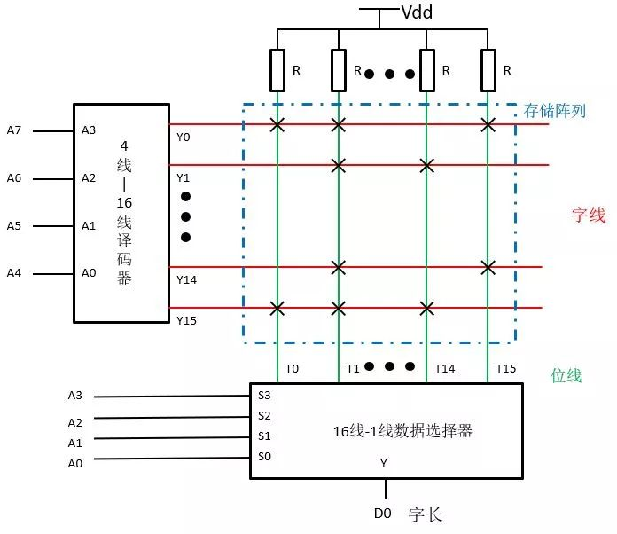
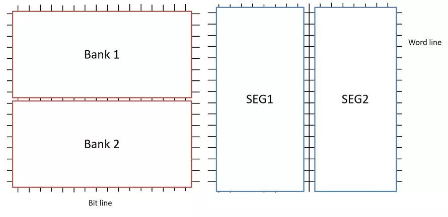
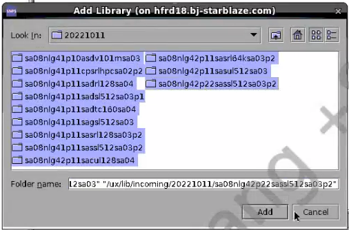
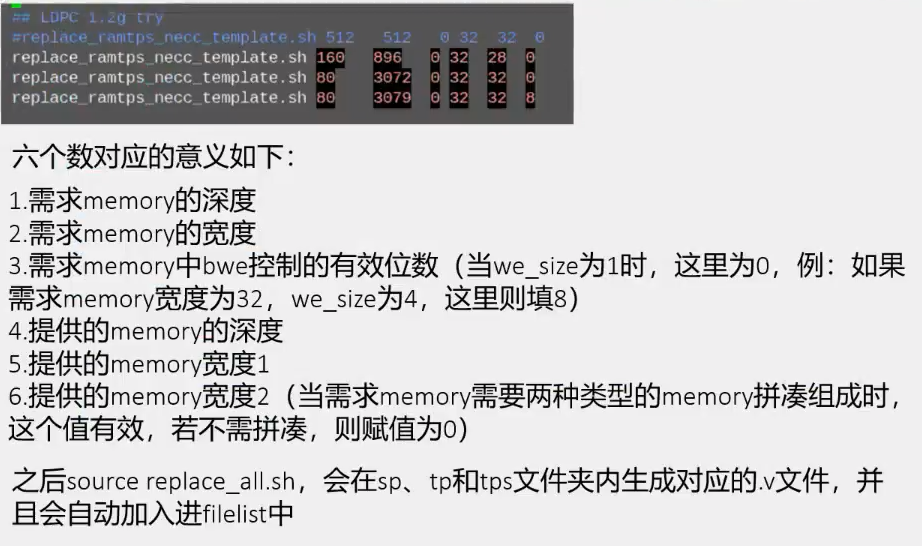
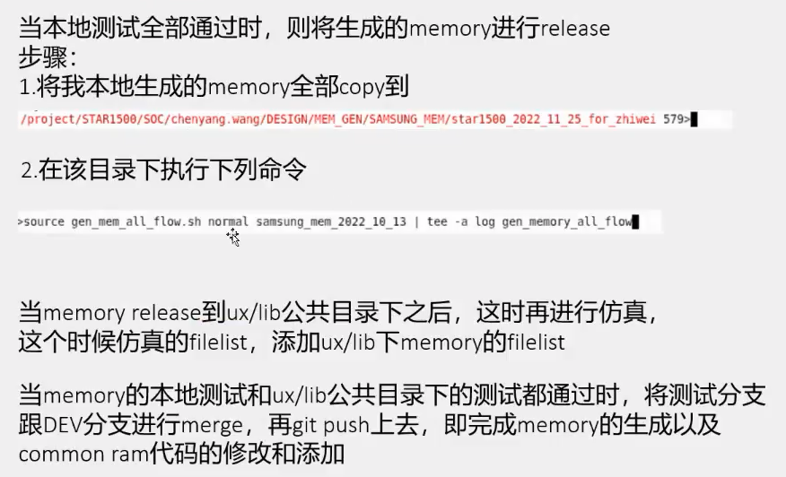

# Memory

# Memory种类

RAM可以分为常用的SRAM和DRAM。
SRAM是静态的存储器，存储单元是一个触发器，有0，1两个稳态；
DRAM是动态的存储器，比SRAM要复杂一些，因为它会利用电容器存储电荷来保存0或1，需要在存储数据的过程中需要对于存储的信息不停的刷新。
 这边还需要提到另一种常用的存储器，我们称为Register File。 它是由多个寄存器堆组成的阵列，内部结构功能上和SRAM完全类似。只是Register File去除了bist电路，容量较小，速度也比较快。

# Memory结构

存储器内部结构基本都差不多。一般由**存储阵列**，**地址译码器**和**输出控制电路**组成。我们把存储阵列以外的电路都称为**外围电路**（Periphery）。
存储阵列是memory的核心区域，它有许多存储单元组成，每个存储单元存放一位二值数据。每次读出一组数据，称为一组字。一个字中所含的位数称为**字长（Bit）**。为了区别各个不同的字，给每个字赋予一个编号，称为**地址**，由译码器将地址代码转译。地址单元个数就是**字数（Depth）**，用N表示，数值为2n，n为地址码的位数。

实际运用中，我们经常以字数（Depth）和字长（Bit）的乘积来表示存储器的容量。如下图中的ROM容量为2^8 x 1，有256个字，字长为1位，总共256个存储单元。容量越大，意味着能存储的数据越多。

# Memory配置

一般foundry提供的memory databook上，会有以下参数指标，然后我们根据上面这个memory来对照一下这些指标。
**WL**: Physical Word Lines 字线  16条
**BL**：Physical Bit Lines  位线   16条
**WD**: Word Depth （WL * MUX）字数   16*16 =256
**BIT**: I/O Data Width （BL/MUX）字长   16/16 =1
**Granularity**：步长，WD或者BIT间隔的大小，只能按步长整数倍增加
**BANK**：分块，在Memory中，如果Bit line很长，会造成它的充放电速度很慢，导致memory的频率很低，这时，我们会将存储阵列分成N个bank来降低Bit line的长度；
**SEG**: 分段，在Memory中，如果Word line很长，会影响它的性能，所以按Word line方向，把存储阵列分成N个segment.；

 BANK和SEG图示如下：
 

**C64，C128，C256**: Cell per bit line。每条bit line上挂的存储单元个数，经常有64，128，256等不同数字；该数值越大，表示配置的memory速度越慢，但是面积会越小；数值越小，表示配置的memory速度越快，但是面积会越大。

通常，大家还会看到类型HD，HC，HP等缩写，这些都是表征不同类型Bitcell和外围电路（Periphery）组成的。 

HD：High Density Bitcell ，面积较小
HC：High Current Bitcell 高工作电流，access time较小
HP：High Performance Periphery  ，速度快
LP：Low-Power Periphery ，功耗较小
ULP：Ultra-Low Power Periphery，超低功耗
ULL：Ultra-Low Leakage Periphery，超低漏电流

# Memory端口

Memory端口类型也有很大的区别，通常分为单口和双口。

**Register file**速度快，面积小，容量小。小容量下，我们应该优先选择Register file，它可以分为以下三种：

**Single port(1RW)**: 一个端口，只能执行读或者写操作
**Two port(1R/1W)**：2个端口，一个端口读，另一个端口写，可以独立不同的时钟频率
**Pseudo two port(1R/1W)**：2个端口，一个端口读，另一个端口写，只有一个时钟。
三个种类的示意图如下：

**SRAM**包含更多的模块，容量可以做得更大，可以拥有更多的bank，速度较慢，面积更大。大容量需求时，可以优先考虑SRAM。SRAM按端口类型也可以分为以下三种：

**Single port(1RW)**: 一个端口，只能执行读或者写操作
**Dual port(2RW)**：2个端口，两个端口可以同时读写，可以独立不同的时钟频率
**Pseudo two port(1R/1RW)**：2个端口，一个端口读，另一个端口可以读可以写，只有一个时钟。
示意图如下：

# Memory Compiler

顾名思义，是用来生成不同容量memory的工具，输入参数，我们就可以得到生成的文件。生成的文件包括：前端设计verilog模型、逻辑综合的时序库、后端需要的电路网表和LEF/GDS版图文件、其他DFT验证相关的、datasheet手册等等。

一般的Memory Compiler提供五个ram脚本（rf_sp, sram_sp, rf_tp, sram_dp, rom）。这意味着可以生成1 Port Register file、Single Port SRAM、2 Port Register file、Dual Port SRAM以及ROM。不同的厂商或许还拥有特殊工艺。通常，MC只生成常用的memory，特殊的往往需要定制或者组合。

MC GUI: integrator, 需要一些环境，及license，目前只能在hfrd18使用。

Memory生成用的库：

# Synopsys Memory

Word range : 深度
IO range ： 宽度
Column mux：决定Memory形状(M2方\M4长)
Bank：影响Memory面积、速度

# Memory生成

1. Integrator GUI生成；
2. ISH 脚本生成；

\\\cdfile\Departments\DD\chenyang.wang\Memory_Training\STAR2000_Memory_Flow_1.mp4
Time：00:39 - end
\\\cdfile\Departments\DD\chenyang.wang\Memory_Training\STAR2000_Memory_Flow_2.mp4

流程：

1. 根据需求在脚本中填入相应参数；
  
    * write_mask：三星N8表示一个bit控制多少bit;
    * ecc_disable = 1 : 不生成 ecc_mem;
    * necc_mux = * : 需要与前面的mux相同；
    * necc_cd = 1：mem里面的控制逻辑放在中间，还是两边；
    * necc_bk = 1：mem内的bank个数，目前写1；
    * gen_lp_sig=1：生成低功耗的控制；
    * redundancy_en=1：针对Memory Repair多生成一些备用；
    * necc_lvt=low：表示docode电路采用那种工艺实现；
    * vendor=snps：表示采用哪家的Memory；
    * track=nt：表示几t的线宽；
    * segm_max_size=80: 超过要分两块；
    * ecc_min_dist=2: ecc校正的连续几个不会出错；
    

2. make mem_gen 生成相应的Memory，包含前端仿真模型 及 后端需要的lib GDS等；
    * 可在Memory目录内查看datasheet，一般看最差的ss40, 可看到Area等信息;
        

    * 如何看一个Memory能跑多快？ Tcycle > Tco + Tnet + Tsetup;  
    * 如何验证生成的Memory？ 像地址内写入递增的数据后，读出进行校验；
     
    
3. common_ram 集成
    * copy 生成的 Memory 到公共库asic_mem；执行：`source gen_mem_all_flow.sh  normal mem`
    * 将新生成的Memory加到相应的emu\model\pwr filelist(FE)；
    * 将新生成的Memory进行db\lib\memory link(BE)；
  
    脚本集成    
    需求深度，位宽 ，mask，拆分深度1，拆分深度2，拆分宽度1，拆分宽度2

4. 更新Backdoor 目录；

      个别Memory有Backdoor访问需求，当相关Memory更新了，需要更新对应的Backdoor目录文件，并在release时通知到相关DV；

  
# Memory仿真

     
# Memory release

source gen_mem_all_flow.sh
>  gen_mem_all_flow.sh 结构如下
    1. 生成db。(1500不用)
    2. 前仿model插入mem init。
    3. 后仿model插入mem init。
    4. 总结所有的filelist到/ux/lib/1500_mem。
    5. 将生成的mem copy到/ux/lib/1500_mem。
    6. 在/ux/lib创建1500_mem/filelist。
    7. 合并filelist到1500_mem/filelist；删除filelist中重复的mem。
    8. 将mem/fielist 转换为emu filelist。
    9. 生成后仿的filelist。
    10. 更新后端Memory/lib链接。
    11. 检查 mem width 15-30之间的。
    12. gen model cell filelist。
    13. timing check。
    14. freq check。
    

# Memory SDC

# Memory ECC
- [ECC加密校验模块原理及实现](https://zhuanlan.zhihu.com/p/681177781)
- [ECC-汉明码详解](https://blog.csdn.net/qq_37708525/article/details/128735265)
- [汉明码原理及实现](https://www.cnblogs.com/Philip-Tell-Truth/p/6669854.html)

参考文献：
[记忆深处有尘埃——Memory Compiler](https://blog.csdn.net/Tao_ZT/article/details/102456813)
[科普Register file和SRAM](https://www.elecfans.com/d/2048028.html)