            

**内容提要**：NVM Express（NVMe）或称非易失性内存主机控制器接口规范（英语：Non Volatile Memory Host Controller Interface Specification，缩写：NVMHCIS），是一个逻辑设备接口规范。它是与AHCI类似的、基于设备逻辑接口的总线传输协议规范（相当于通讯协议中的应用层），用于访问通过PCI Express（PCIe）总线附加的非易失性存储器介质（例如采用闪存的固态硬盘驱动器），虽然理论上不一定要求 PCIe 总线协议。

# 1 综述

NVMe over PCIe协议，定义了NVMe协议的使用范围、指令集、寄存器配置规范等。

## 1.1 名词解释

### 1.1.1 Namespace

Namespace是一定数量逻辑块（LB）的集合，属性在Identify Controller中的数据结构中定义。

### 1.1.2 Fused Operations

Fused Operations可以理解为聚合操作，只能聚合两条命令，并且这两条命令在队列中应保持相邻顺序。协议中只有NVM指令才有聚合操作。还需要保证聚合操作的两条命令读写的原子性，参考Compare and Write例子。

### 1.1.3 指令执行顺序

除了聚合操作（Fused Operations），每一条SQ中的命令都是独立的，不必考虑RAW等数据相关问题，即使考虑，也是host应该解决的问题。

### 1.1.4 写单元的原子性

控制器需要支持写单元的原子性。但有时也能通过host配置Write Atomicity feature，减小原子性单元的大小，提高性能。

### 1.1.5 元数据

数据的额外信息，相当于提供校验功能。可选的方式。

### 1.1.6 仲裁机制

用来选择下一次执行的命令的SQ的机制，三种仲裁方式：

*   RR（每个队列优先级相同，轮转调度）
    
*   带权重的RR（队列有4种优先级，根据优先级调度）
    
*   自定义实现
    

### 1.1.7 逻辑块（LB）

NVMe定义的最小的读写单元，2KB、4KB……，用LBA来标识块地址，LBA range则表示物理上连续的逻辑块集合。

### 1.1.8 Queue Pair

由SQ（提交队列）与CQ（完成队列）组成，host通过SQ提交命令，NVMe Controller通过CQ提交完成命令。

### 1.1.9 NVM 子系统

NVM子系统包括控制器、NVM存储介质以及控制器与NVM之间的接口。

## 1.2 NVMe SSD

### 1.2.1基本架构

整体来看，NVMe SSD可以分为三部分，host端的驱动（NVMe官网以及linux、Windows已经集成了相应的驱动）、PCIe+NVMe实现的控制器以及FTL+NAND Flash的存储介质。

### 1.2.2 NVMe控制器

NVMe控制器实质上为DMA + multi Queue，DMA负责数据搬运（指令+用户数据），多队列负责发挥闪存的并行能力。

# 2 PCIe寄存器配置

NVMe over PCIe，通过利用PCIe总线实现数据交互的功能，实现对物理层的抽象功能。

## 2.1 PCIe总线的基本结构

PCIe总线分为三层，物理层，数据链路层，处理层（类似于计算机网络的分层结构），通过包来转发数据。NVMe协议定义的内容相当于PCIe的上一层应用层，处于应用层。PCIe给NVMe提供了底层的抽象。

NVMe SSD相当于一个PCIe的端设备（EP）。

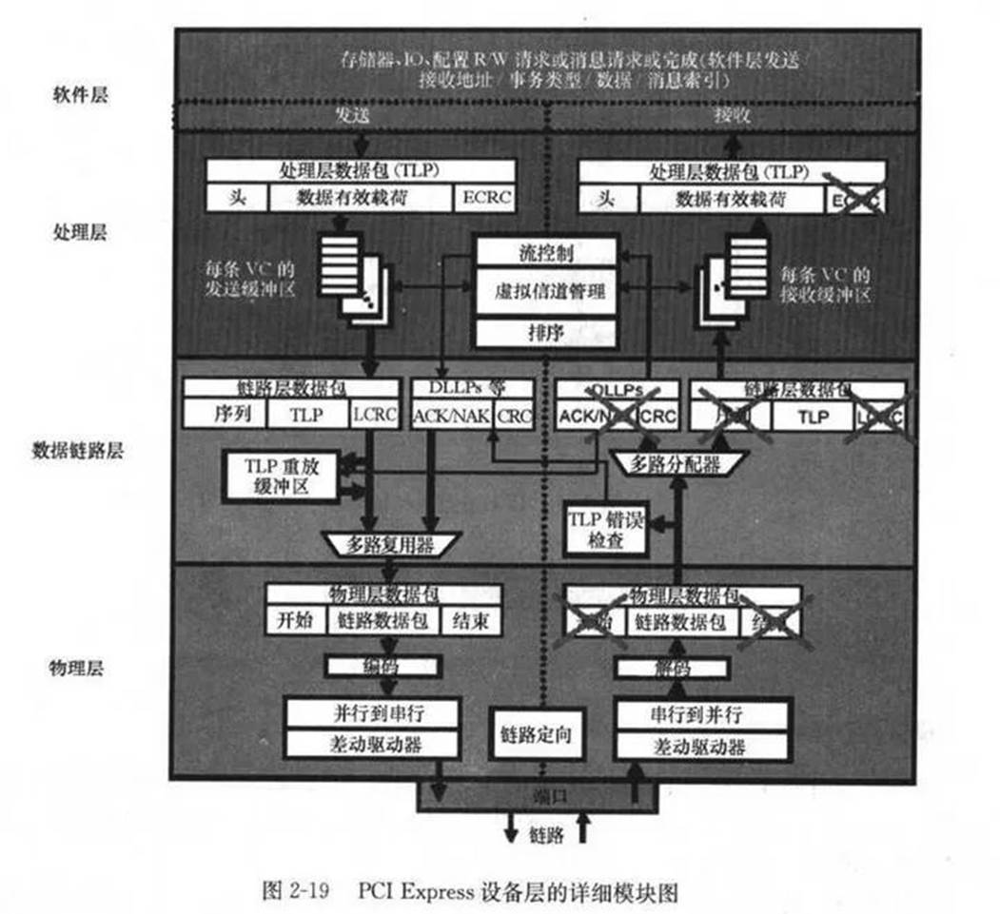

## 2.2 寄存器配置

在协议中主要定义了PC header、PCI Capabilities和PCI Express Extended Capabilities三部分内容。

具体在host内存中会占有4KB，结构如下：

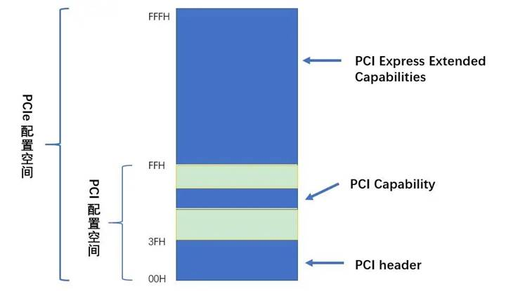

### 2.2.1 PCI header

PCI header有两种类型，type0表示设备，type1表示桥。NVMe 控制器属于EP，所以定义为type0的类型。共64KB，如下图：

### 2.2.2 PCI Capabilities

这里配置了PCI Capbilities，包括电源管理、中断管理（MSI、MSI-X）、PCIe Capbilities。

### 2.2.3 PCI Express Extended Capabilities

这里配置有关错误恢复等高级功能。

# 3 NVMe寄存器配置

## 3.1 寄存器定义

NVMe寄存器主要分为两部分，一部分定义了Controller整体属性，一部分用来存放每组队列的头尾DB寄存器。

1. CAP——控制器能力，定义了内存页大小的最大最小值、支持的I/O指令集、DB寄存器步长、等待时间界限、仲裁机制、队列是否物理上连续、队列大小；

2. VS——版本号，定义了控制器实现NVMe协议的版本号；

3. INTMS——中断掩码，每个bit对应一个中断向量，使用MSI-X中断时，此寄存器无效；

4. INTMC——中断有效，每个bit对应一个中断向量，使用MSI-X中断时，此寄存器无效；

5. CC——控制器配置，定义了I/O SQ和CQ队列元素大小、关机状态提醒、仲裁机制、内存页大小、支持的I/O指令集、使能；

6. CSTS——控制器状态，包括关机状态、控制器致命错误、就绪状态；

7. AQA——Admin 队列属性，包括SQ大小和CQ大小；

8. ASQ——Admin SQ基地址；

9. ACQ——Admin CQ基地址；

10. 1000h之后的寄存器定义了队列的头、尾DB寄存器。

## 3.2 寄存器理解

1. CAP寄存器标识的是Controller具有多少能力，而CC寄存器则是指当前Controller选择了哪些能力，可以理解为CC是CAP的一个子集；如果重启（reset）的话，可以更换CC配置；

2. CC.EN置一，表示Controller已经可以开始处理NVM命令，从1到0表示Controller重启；

3. CC.EN与CSTS.RDY关系密切，CSTS.RDY总是在CC.EN之后由Controller改变，其他不符合执行顺序的操作都将产生未定义的行为；

4. Admin队列有host直接创建，AQA、ASQ、ACQ三个寄存器标识了Admin队列，而其他I/O队列则有Admin命令创建（eg，创建I/O CQ命令）；

5. Admin队列的头、尾DB寄存器标识为0，其他I/O队列标识由host按照一定规则分配；只有16bit的有效位，是因为队列深度最大64K。

# 4 内存数据结构

## 4.1 SQ与CQ的详细定义

### 4.1.1 空队列

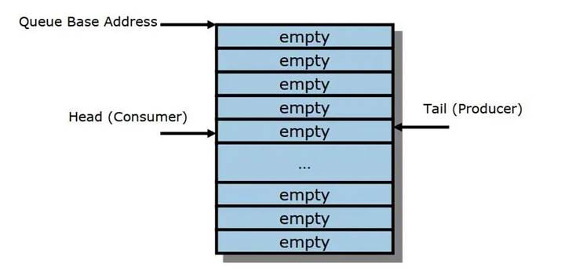

### 4.1.2 满队列

判断队列满可以有多种方法，协议中规定的是头指针比尾指针大一，所以队列满时，空余一个元素。

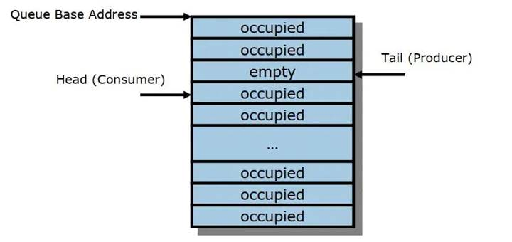

### 4.1.3 队列性质

1\. 队列大小有16bit，最小队列大小为2个元素（因为满队列的定义方式，所以最小为2个元素），对于I/O队列，最大队列大小为64k；对于Admin队列，最大队列为4k；

2\. QID来标识唯一ID，16bit，由host分配；

3\. host可以修改队列优先级（如果支持的话），共四级，U、H、M、L；

## 4.2 仲裁机制

### 4.2.1 RR

RR仲裁，Admin SQ与I/O SQ优先级相同，控制器每次可以选择一个队列中的多个命令（Arbitration Burst setting）。

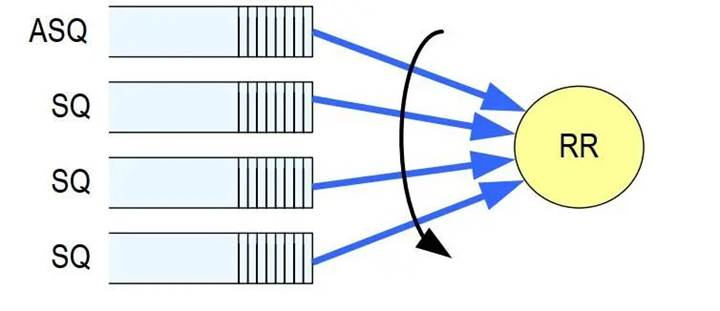

### 4.2.2 带有优先权的RR

有3个严格的优先权，Priority1 > Priority2 > Priority3，在这三个优先级队列中，高优先级的队列中如果有命令，则优先执行（非抢占式）。

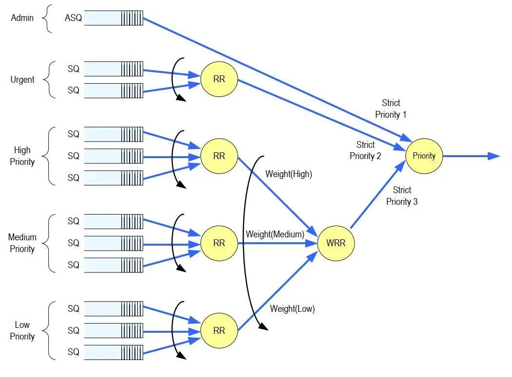

### 4.2.3 其他仲裁方式

Vendor Specific。

## 4.3 数据寻址方式（PRP和SGL）

### 4.3.1 PRP

NVMe把Host的内存分为页的集合，页的大小在CC寄存器中配置，PRP是一个64位的内存物理地址指针，结构如下：

最后两位为0，指四字节对齐；（n：2）位表示页内内偏移。

举个例子，内存页大小位4KB，则（11：2）表示页内偏移。

PRP寻址有两种方式，直接用PRP指针寻址，通过PRP List寻址。当使用PRP List寻址时，偏移必须为0h，每一个PRP条目表示一个内存页，如下：

Admin命令的数据地址只能采取PRP的方式，I/O命令的数据地址既可以采取PRP的方式，又可以采取SGL的方式。Host在命令中会告诉Controller采用何种方式。具体来说，如果命令当中DW0\[15：14\]是0，就是PRP的方式，否则就是SGL的方式。

命令的Dword6~Dword9只定义了PRP1、PRP2两个数据指针，通过PRP条目可以指向PRP List。如下图：

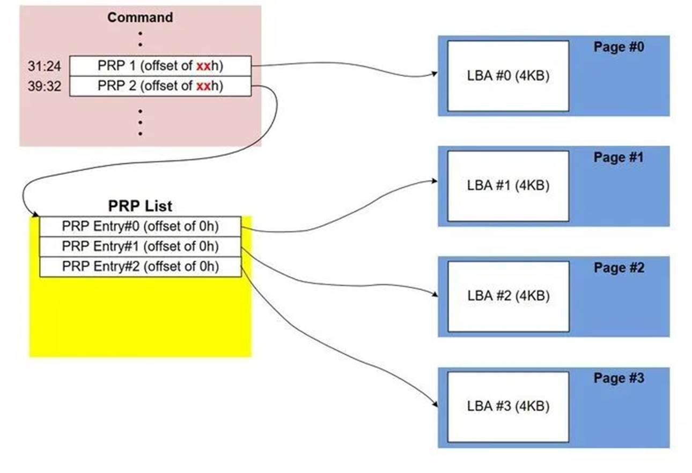

在上面的例子中，PRP1直接指向内存页，PRP2指向PRP List存在的地址，在PRP List中存有数据的真正的地址。

**更详细的说**：

协议中PRP Entry是一个指向物理内存页的指针。PRP被用作NVMe Controller和PC内存之间进行数据传输。PRPEntry是固定大小的（8B）。

首先，明确两个概念，PRP Entry 为PRP指针，PRP List为PRP列表指针，示意图如下：

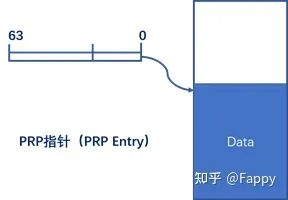

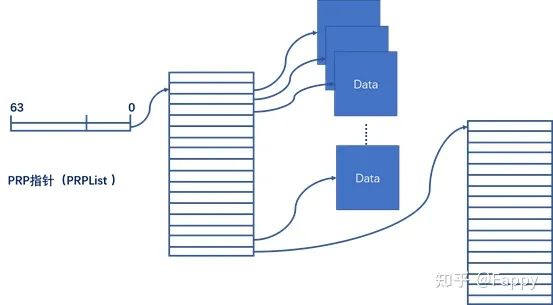

**根据每次传输数据的大小，以及PRP指针的偏移（offset）可以分为以下五种情况**：

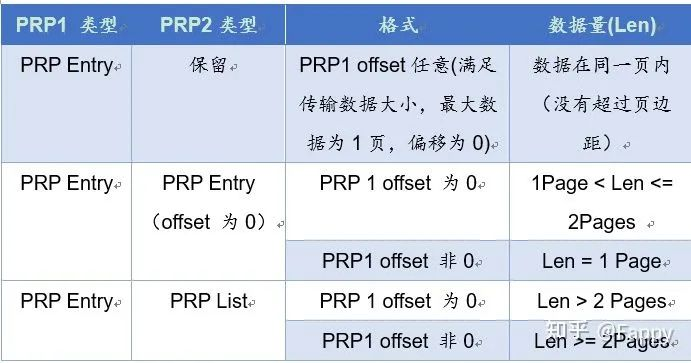

### 4.3.2 SGL

SGL是另外一种索引内存的数据结构。SGL由若干个SGL段组成，SGL段又由若干个SGL描述符组成，所以SGL描述符是SGL数据结构的基本单位。

目前定义的SGL描述符有6种：

1. SGL 数据描述符，用来索引数据块地址，host内存；

2. SGL 垃圾数据描述符，用来索引无用数据；

3. SGL 段描述符，用来索引下一个SGL段；

4. SGL 最后一个段描述符，用来索引最后一个SGL段；

5. keyed SGL 数据描述符；

6. Transport SGL 数据描述符；

在上面SGL例子中，共有3个SGL段，用到了4种SGL描述符。Host需要往SSD中读取13KB的数据，其中真正只需要11KB数据，这11KB的数据需要放到3个大小不同的内存中，分别是：3KB，4KB和4KB。

### 4.3.3 比较PRP与SGL

无论是PRP还是SGL，本质都是描述内存中的一段数据空间，这段数据空间在物理上可能连续的，也可能是不连续的。Host在命令中设置好PRP或者SGL，告诉Controller数据源在内存的什么位置，或者从闪存上读取的数据应该放到内存的什么位置。

SGL和PRP本质的区别在于，一段数据空间，对PRP来说，它只能映射到一个个物理页，而对SGL来说，它可以映射到任意大小的连续物理空间，具有更大的灵活性，也能够描述更大的数据空间。如下图：

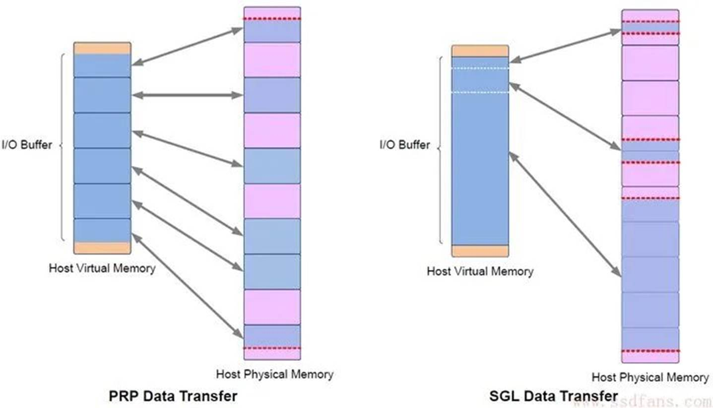

# 5 NVMe协议定义的命令

## 5.0 命令执行过程

命令由host提交到内存中的SQ队列中，更新TDBxSQ后，NVMe控制器通过DMA的方式将SQ中的命令（怎么取，如何取，取多少，因设计而异）取到控制器缓冲区，执行命令；执行完成后，根据执行状态，组装完成命令，仍然通过DMA的方式将完成命令写入内存CQ的队列中；NVMe控制器通过MSI-X中断方式通知host已完成命令；最后，host处理CQ命令，更新控制器中HDBxCQ，标识着命令真正完成。

## 5.1 命令分类

命令分为Admin指令与NVM指令（I/O指令）。

Admin指令只能提交到Admin Controller中，主要负责管理NVMe控制器，也包含对NVM的一些控制指令。

NVM 指令只能提交到I/O Controller中，主要负责完成数据的传输。

在1.0e版本中，Admin指令有15条（3条与NVM相关），NVM指令有6条；在1.3d版本中，Admin指令有15条（3条与NVM相关），NVM指令有11条。

## 5.2 命令通用格式

命令均为64字节，具有相同的格式，某些字段根据命令的不同有不同的定义。

| Dword0 | CID、传输方式、聚合操作、操作码 |
| ----- | ---------------- |
| 1     | NID（命名空间ID） |
| 2     | 保留              |
| 3     | 保留              |
| 4、5   | 元数据指针(MPTR)  |
| 6-9   | 数据指针（DPTR）  |
| 10-15 | 根据命令指定      |

完成命令同样具有相同的格式，某些字段根据命令的不同有不同的定义。

| Dword0 |   根据命令指定   |
| ------ | --------------- |
| 1      | 保留             |
| 2      | SQID、SQ头指针   |
| 3      | 状态域、P位、CID |

## 5.3 Admin 指令

Admin指令与NVM指令根据放置的的队列组（Queue Pair）来区分，Admin指令在Admin CQ与SQ里，NVM指令在I/O CQ与SQ里。

通过Dword0中的8位操作码定义不同指令，注意并不是绝对的顺序增加（eg，没有03h）。每一种指令都对应有其完成命令，通过SQID（提交队列ID）+CID（命令ID）唯一标识完成的命令。

| 操作码 | 指令 | 作用 |
| --- | --- | --- |
| 00h | 删除I/O SQ， | 释放SQ空间 |
| 01h | 创建 I/O SQ， | 保存host分配给SQ的地址、队列优先权、队列大小 |
| 02h | 获取日志， | 返回所选日志页于缓冲区 |
| 04h | 删除 I/O CQ， | 释放CQ空间 |
| 05h | 创建 I/O CQ， | 保存host分配给CQ的地址、中断向量、队列大小等 |
| 06h | Identify | 返回关于controller与namespace能力和状态的数据结构（2k字节） |
| 08h | 撤销， | 用来撤销之前完成的指令，best-effort |
| 09h | 设置features | 根据FID设置相应的features |
| 0Ah | 获取 features， | 根据FID返回队列数量、仲裁信息等 |
| 0Ch | 异步事件请求， | Controller向host报告运行信息（error or health） |
| 10h | 固件激活， | 验证下载的镜像，提交到Firmware Slot（1-7）中 |
| 11h | 固件镜像下载， | 下载固件镜像 |

Note：

* Admin队列是通过配置ASQ等寄存器创建的
* 先创建CQ再创建SQ

## 5.4 NVM指令

NVMe控制器读写的最小单元是LB，层次图如下：

NVM指令与Admin指令结构完全相同，也是通过Dword0中的8位操作码来定义不同指令。

| 操作码 |         指令         |                       作用                        |
| ------ | ------------------- | ------------------------------------------------- |
| 00h    | Flush               | 将数据（和元数据）提交到NVM中，所有命令都要执行        |
| 01h    | Write               | 将数据（和元数据）写入NVM中                         |
| 02h    | Read                | 读NVM中的数据（和元数据）                           |
| 04h    | Wirte Uncorrectable | 标记无效数据块                                     |
| 05h    | Compare             | 比较从NVM端读出的数据和比较数据缓冲区的数据           |
| 09h    | Dataset Management  | 标识一定范围数据的特点，eg，频繁读、频繁写（提升性能） |

# 6 控制器结构

控制器从功能上可以分为三类，I/O、Admin和Discovery。

在实现过程中，Admin 控制器只有一个，负责管理控制器及其他控制功能。控制器只是抽象的概念，应用于具体的实现中，可能是一个具体的模块，也可能多个模块。

控制器主要的作用是实现对NVMe定义命令的翻译，从而实现数据传输、状态控制等功能。

## 6.1 命令执行过程

1\. host将命令（1条或者多条）写入提前分配好的SQ中；

2\. 更新对应SQ的DB寄存器；

3\. NVMe控制器取SQ中命令（通过HDB和TDB可以判断是否有未完成命令）；

4\. NVMe控制器执行命令；

5\. NVMe 控制器在命令完成后，将完成命令（可能执行成功，也可能失败，但都会返回完成命令）写入host内存SQ对应的CQ中；

6\. NVMe 控制器根据实现的中断方式，提醒host命令已完成；

7\. host响应中断，处理完成命令；

8\. host 更新对应CQ的DB寄存器。

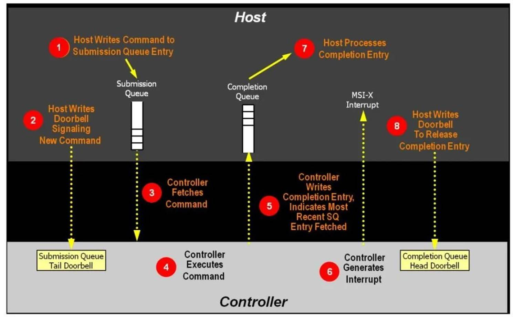

## 6.2 重启（Reset）

### 6.2.1 Controller level

Controller重启可能发生在PCIe总线重启、PCI重启、**控制器CC.EN从1到0重启。当重启发生时：**

1. 所有的I/O SQ和CQ都被删除；

2. 所有未完成的指令（Admin和I/O）应该执行撤销操作；

3. Controller处于idle状态，CSTS.RDY清0；

4. AQA、ASQ、ACQ不受影响。

重启后，host操作：

1. 更新寄存器状态；

2. 将CC.EN置1；

3. 等待CSTS.RDY置1；

4. 使用Admin命令配置Controller；

5. 创建I/O CQ和SQ；

6. 执行正常的I/O指令。

### 6.2.2 Queue level

队列水平的重启，即，删除该队列，再重新创建一个新队列。删除队列的时候，host应该保证队列处于idle状态（所有命令均已完成——接收到了完成命令），否则的话，可能会导致CQ接收不到提交命令的完成命令。

## 6.3 中断

在Controller完成SQ命令后，根据执行状态，将结果组装成完成命令写入CQ中，Controller通过中断机制通知Host处理完成命令。

NVMe协议中支持的中断方式有4种，pin-based、Single MSI、Multi-message MSI和MSI-X，协议推荐采用MSI-X中断方式，能够支持更多的中断向量（2K）。

MSI-X允许每一个CQ发送自己的中断信息（相比于发一条中断信息提醒全部CQ队列有很大的优势）。在产生MSI-X中断信息前，需要检查该中断在相应寄存器种不被屏蔽。

## 6.4 Controller初始化

Controller的初始化过程：

1. 设置PCI和PCIe寄存器；

2. 等待CSTS.RDY变为；

3. 配置AQA、ASQ、ACQ寄存器；

4. 配置CC寄存器；

5. 将CC.EN置1；

6. 等待CSTS.RDY置1

7. Host通过Identify命令，确定Controller的数据结构、确定Namespace的数据结构；

8. Host通过get features（协议中是set features，待研究）获取I/O SQ和CQ信息，然后配置中断机制；

9. Host分配适当的I/O CQ、SQ队列；

10. 如果Host希望获取Controller的错误或健康信息，可以添加异步事件请求命令。

Controller 关机

正常关机：

1. Host停止提交新的I/O命令，但允许未完成的命令继续完成；

2. Host删除所有I/O SQ，删除所有SQ队列后，所有未完成的命令将被撤销；

3. Host删除所有I/O CQ；

4. Host将CC.SHN置01b，表示正常关机；关机程序完成时，将CSTS.SHST置10b。

突然关机：

1. Host停止提交新的I/O命令；

2. Host将CC.SHN置10b，表示突然关机；关机程序完成时，将CSTS.SHST置10b

## 6.5 host端命令实例

### 6.5.1 创建命令

### 6.5.2 处理完成命令

## 6.6 NVMe与PCIe交互实例（分析包结构）

以Host发出read命令为例。

1. Host准备了一个Read命令给SSD：

分析该包，Host需要从起始LBA 0x20E0448(SLBA)上读取128个DWORD (512字节)的数据，读到哪里去呢？PRP1给出内存地址是0x14ACCB000。这个命令放在编号为3的SQ里 (SQID = 3)，CQ编号也是3 (CQID = 3)

1. Host通过写SQ的Tail DB，通知Controller来取命令：

上图中，上层是NVMe层，下层是PCIe传输层的TLP。Host想往SQ Tail DB中写入的值是5。PCIe是通过一个Memory Write TLP来实现Host写CQ的Tail DB的。该Tail DB寄存器映射在Host的内存地址为F7C11018，由于NVMe 的寄存器映射到了Host内存中，所以可以根据这个地址写入寄存器值。

1. SSD收到通知，去Host端的SQ中取指。

PCIe是通过发一个Memory Read TLP到Host的SQ中取指的。可以看到，PCIe需要往Host内存中读取16个DWORD的数据（一个NVMe指令大小），

1. SSD执行读命令，把数据从闪存中读到缓存中，然后把数据传给Host：

SSD是通过Memory write TLP 把Host命令所需的128个DWORD数据写入到Host命令所要求的内存中去。SSD每次写入32个DWORD，一共写了4次。

1. SSD往Host的CQ中返回状态：

SSD是通过Memory write TLP 把16个字节的命令完成状态信息写入到Host的CQ中。

1. SSD采用中断的方式告诉Host去处理CQ：

上图使用的是MSI-X中断方式。这种方式将中断信息和正常的数据信息一样，PCIe打包把中断信息告知Host。SSD还是通过Memory Write TLP把中断信息告知Host，这个中断信息长度是1DWORD。

1. Host处理相应的CQ

2. Host处理完相应的CQ后，需要更新SSD端的CQ Head DB告知SSD处理

完成：

Host还是通过Memory Write TLP更新SSD端的CQ Head DB。

该过程完整的包流程如下：

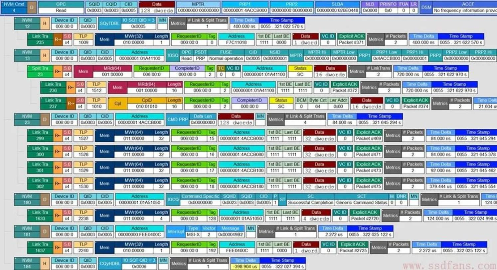

# 7 NVMe features

## 7.1 固件（Firmware）更新过程

1\. 将固件下载到Controller中（使用 Firmware Image Download命令）；

2\. Host提交Firmware Activate命令（也可以激活之前版本的Controller镜像）；

3\. Controller reset；

4\. reset完成后，Host重新初始化Controller，包括Host重新分配I/O队列，与reset步骤相同。

## 7.2 元数据（Metadata）传输

元数据的使用并没有强制规定，最经常的使用方法是用做端到端数据的保护信息。有两种传输元数据的方式，一种可以作为LB数据块的一部分，如下图：

另一种可以单独作为一个逻辑块传输，如下图：

## 7.3 端到端的数据保护

端到端，一端指主机的内存空间，一端指闪存空间（NVM）。数据传输的两个环节如下图：

数据在PCIe上传输的时候，由于信道噪声的存在（说白了就是存在干扰），可能导致数据出错；另外，Controller闪存之间，数据也可能发生错误。采用元数据进行数据的保护是最常用的一种手段。

充当保护数据角色的元数据结构如下：

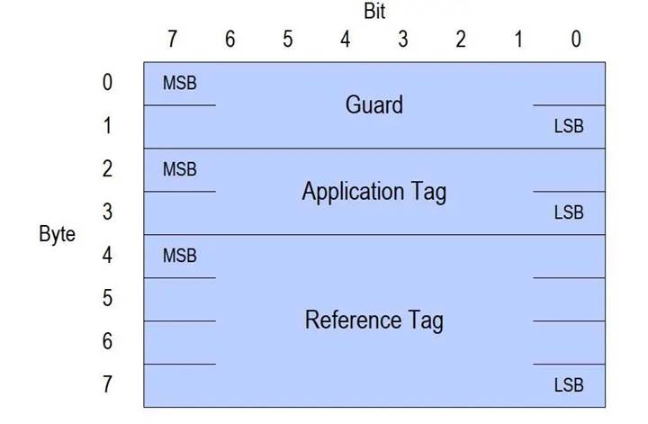

其中，Guard为16bit的CRC校验码，Application Tag与LBAT相关，Reference Tag将用户数据和地址（LBA）相关联。下图为以512bytes的数据块为例：

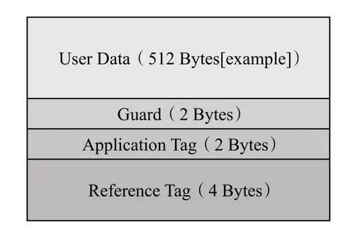

那么按照排列组合，共有四种保护情况（1带2带、1不带2不带、1带2不带、1不带2带）。但由于协议中控制保护信息的只有两个字段(1. 是否采用保护 2. PRACT位)，只有三种情况，如下图（是以写命令为例，读命令相同）：

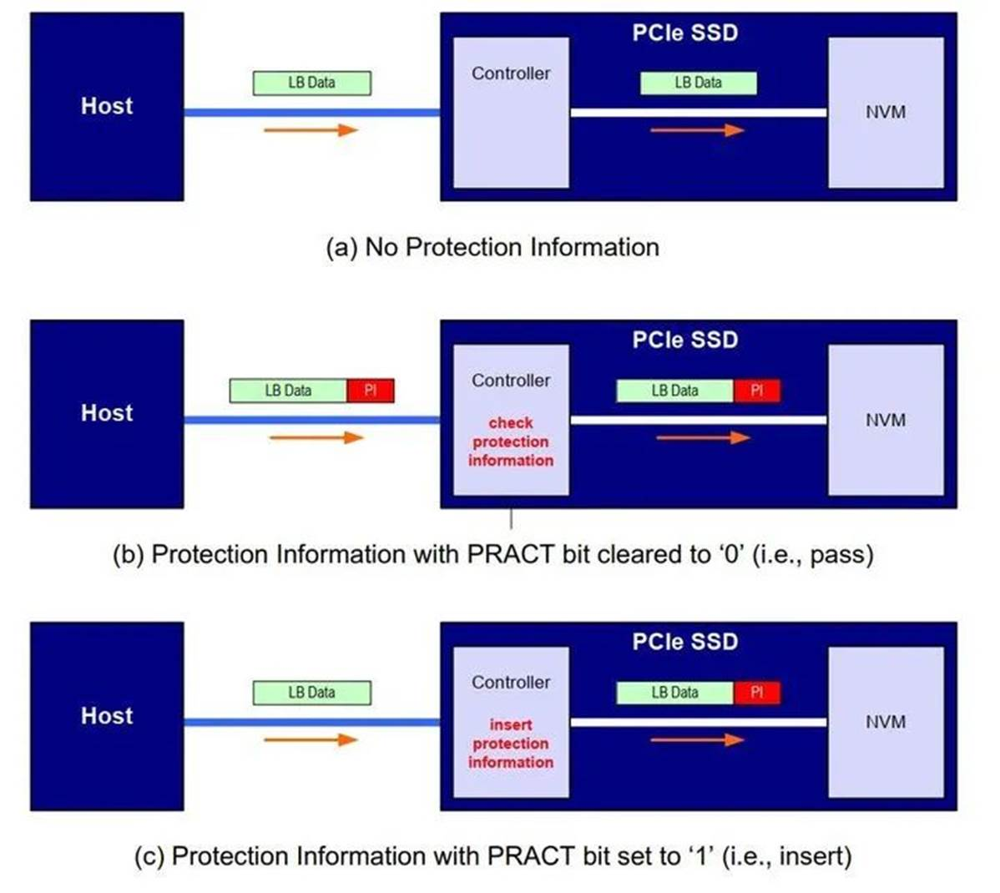

# 原文链接
1. 作者：Fappy，https://zhuanlan.zhihu.com/p/347599423
2. [NVMe技术基础知识](https://mp.weixin.qq.com/s/vzYzqorJqbu9buJHDrrNCw)