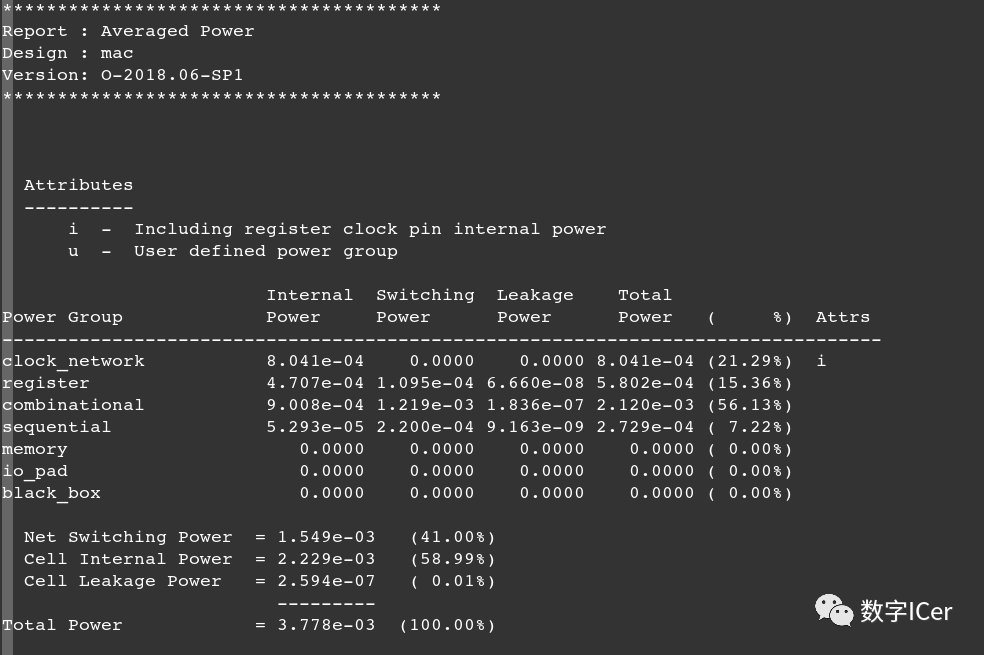

功耗分析或功耗评估是基于跟踪设计中所有元件的开关活动的。
**平均功耗**是通过累积收集开关活动来估算的，并不管开关活动实际发生的时间或周期。
**峰值功耗**是通过逐周期地跟踪开关活动来计算的。

# PTPX功耗分析_Average Power Analysis
PTPX，是基于PT，对全芯片进行power静态和动态功耗分析的工具。包括门级的平均功耗和峰值功耗。可以说PTPX就是PT工具的一个附加工具。

PT如果report\_power需要额外的PTPX的licence，可以通过以下变量打开：

**set\_app\_var power\_enable\_analysis true （默认是false）**

PrimeTime PX支持两种功耗分析模式：averaged mode和time-based mode。

**Average Power Analysis**

用PTPX做平均功耗分析，利用**后仿**产生的VCD/SAIF文件，通过read\_vcd/read\_saif将真实的翻转率反标到网表上，然后通过report\_switching\_activity检查反标率，最后report\_power报告功耗值。

平均功耗，是基于翻转率toggle rate来分析的。翻转率的标注，可以是默认翻转率、用户定义switching activity、SAIF文件或者VCD文件。功耗结果期望准确的话，首先要保证翻转率的标注要准确。这意味着需要后端布局布线、时钟树等已经完全稳定了。

前期做功耗分析，可能只是一个评估作用。

工具支持基于仿真的switching activity文件类型，包括：

*   VCD
*   FSDB
*   VPD
*   SAIF

波形转saif命令

```Tcl
vcd2saif:
vcd2saif-idump.vcd-ovcd2saif.saif
fsdb2saif:
fsdb2saifdump.fsdb-ofsdb2saif.saif
```

如果没有上述文件，那可以使用user-define switching activity commands，来提供一个现实的activity去精确power结果。

所需基本文件:

*   logic库文件，必须是.db格式；
*   网表文件，支持verilog、vhdl网表，db、ddc、Milkyway格式的网表；
*   sdc文件，计算平均功耗；
*   spef文件，寄生参数信息。
*   VCD/saif文件,记录翻转率（若没有，则需要人为设置翻转率）。

基本流程

**Step1: 设置功耗分析模式**

```Tcl
setpower_enable_analysis TRUE
setpower_analysis_mode averaged
```

**Step2: read设计，对网表工艺库link**

```Tcl
setsearch_path "../src/hdl/gate../src/lib/snps."
setlink_library "*core_typ.db"
read_verilog mac.vg
current_design mac
link
```

**Step3: 读sdc，反标寄生参数**

sdc指定了设计的驱动单元，用以计算输入的transitiontime。

寄生参数是影响动态功耗的因素之一，反标寄生参数文件能够提高功耗分析的准确性。

```Tcl
read_sdc ../src/hdl/gate/mac.sdc
set_disable_timing [get_lib_nsssc_core_typ/*/G]
read_parasitics ../src/annotate/mac.spef.gz
```

**Step4: timing报告**

满足时序要求，功耗分析才有意义

```Tcl
check_timing
update_timing
report_timing
```

**tep5: 读入switching\_activity文件**

读后仿产生的VCD/SAIF文件将真实的翻转率反标到Net上，在read\_vcd或者read\_saif时要注意通过-stripe\_path选项指定合适的hierarchical层次，否则activity反标不上;

\-list\_not\_annotated列出没有被反标的对象;

读入saif文件：

```Tcl
read_saif "../sim/mac.saif" -strip_path "tb/Dut"
report_switching_activity -list_not_annotated
```

读入vcd文件：

```Tcl
read_vcd "../sim/vcd.dump.gz" -strip_path "tb/Dut"
report_switching_activity -list_not_annotated
```

**step6: 执行功耗分析**

在得到switching activity之后，使用update\_power来将其反标，使用report\_power来报告power值。

```Tcl
check_power
update_power
report_power
```

读入saif文件的功耗报告


读入vcd文件的功耗报告



可以看出saif/vcd文件的功耗略有差异。

附Averaged Power Analysis Mode Script脚本：

```Tcl
setpower_enable_analysis TRUE
setpower_analysis_mode averaged

#####################################################################
#link design
#####################################################################
setsearch_path "../src/hdl/gate../src/lib/snps ."
setlink_library "*core_typ.db"

read_verilog mac.vg
current_design mac
link

#####################################################################
#read SDC
#####################################################################
read_sdc ../src/hdl/gate/mac.sdc
set_disable_timing [get_lib_pinsssc_core_typ/*/G]

#####################################################################
#set transition time/annotate parasitics
#####################################################################
read_parasitics ../src/annotate/mac.spef.gz

#####################################################################
#check/update/report timing
#####################################################################
check_timing
update_timing
report_timing

#####################################################################
#read switching activity file
#####################################################################
##read_vcd" ../sim/vcd.dump.gz" -strip_path "tb/Dut"
read_saif "../sim/mac.saif" -strip_path "tb/Dut"
report_switching_activity -list_not_annotated

#####################################################################
#check/update/report power
#####################################################################
check_power
update_power
report_power
quit

```

## VCD\SAIF\FSDB的区别

**VCD:** Value/Variable Change Dump  

* 它是一种基于事件的格式，包含了设计中信号的每一个数值变化和发生的时间。
*   VCD 在**averaged**和**time-based**的分功耗析模式下均受支持，是国际标准格式
*   Gate-Level VCD和RTL-Level VCD都可以，**但是使用RTL-Level VCD时，需要进行name mapping (set\_rtl\_to\_gate\_name)**。
*   VCD文件示例：[http://en.wikipedia.org/wiki/Value\_change\_dump](http://en.wikipedia.org/wiki/Value_change_dump)  
 
  
**SAIF:** Switching Activity Interface Format  

* 它捕获信号转换和在每个逻辑电平上花费的时间。SAIF 文档包含设计中网络的切换计数和静态概率。
* SAIF 仅在**averaged**功耗分析模式下受支持。
*   有些工具，比如ICC/ICC2，只支持SAIF文件，需要将VCD转换成SAIF文件，在PT安装目录下有一个utility：  
*   vcd2saif -input vcd\_file -output saif\_file ...  
        

**FSDB:** Fast Signal DataBbase  

*   类似于VCD的波形文件，去除了VCD中的冗余信息，数据量小很多，提高了仿真的速度，Synopsys的仿真工具支持较多。