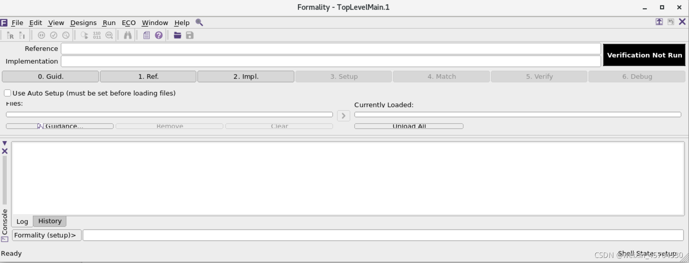
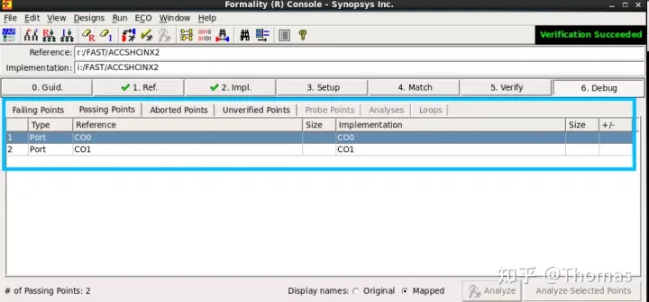
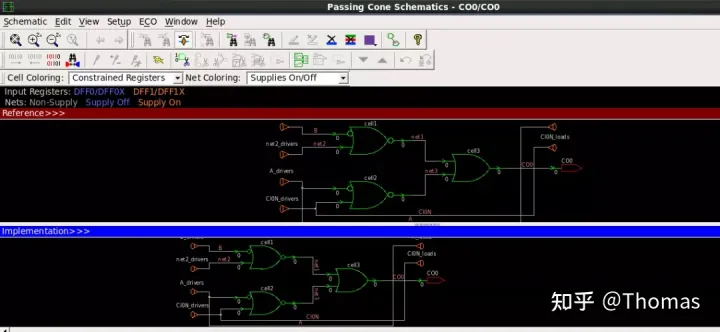

# Formality使用总结

## 形式验证在设计流程中的位置

- 在综合后：在综合的流程中通常会插入DFT，这样综合出的结果的逻辑关系可能会与RTL代码的等效逻辑不一致，因此利用利用形式验证来保证综合过程没有出错，逻辑正确。
- 后端布局布线后：使用综合网表和和布局布线后网表进行比较。
- 设计形式发生变化，则需要做形式验证。

## 形式验证的应用

- 综合的网表与RTL对比做形式验证。保证综合过程没有逻辑错误，保证综合后的网表正确。
- 后端网表与综合后的网表对比做形式验证。保证后端没有引入逻辑错误。
- 做ECO的时候，ECO后的网表与ECO后的RTL做形式验证。（ECO当芯片已经流片出去了，工厂只做了一个底层，但金属层还没做可以做metalECO，发现某些容易修的bug后可以利用一些冗余的cell改变某些连线来修掉这个Bug，修改后端网表的同时对RTL也进行相应修改，然后将这两个文件进行LEC比较）

## 图形界面启动方式

在命令行输入formality,接着可以看到如下界面  
以下1~6为进行formality的流程

### 0、Guid

在这一步导入DC综合产生的.svf文件，该文件记录了DC在综合时对设计所作的优化。  

然后
  
底下log一栏返回“1”表示加载成功。

### 1、Ref

这一步是加载你的设计文件，RTL代码及IP等。  
可以看到有三个步骤需要执行，分别为  
1）Read Design File  
2) Read DB Libraries  
3) Set Top Design

#### Read Design File

根据自己的设计，选择需要读取的文件类型，如“Verilog”。选中需要添加的设计文件，点击Open，导入设计文件。  
  
如果设计中用到了某些Design Ware库中的IP，还需要设置搜索目录，如果没有可以跳过该步。


#### Read DB Libraries

如果代码中例化了一些IO或Macro,或者例化了标准单元库中的一些单元，这里需要读取它们的DB文件，如下图。  
  


#### Set Top Design

设置完顶层之后，如果成功，log栏会返回“1”，如果返回“0”，可以看一下该链接[link](https://blog.csdn.net/weixin_43755290/article/details/105097210)中的一个解决办法。

### 2、Impl

该步跟上面1类似，加载相关文件之后，设置顶层。注意，此处在Read Design File这一步加载的是DC综合后的网表文件。

### 3、Setup

这一步是设置环境，如关于JTAG或SCAN的设置等，没有的话可以跳过。

### 4、Match

检查ref.和impl.的比较点是否匹配。点击"4.Match"，选择“Run Matching"，等待匹配完成。  
该步运行完成之后如下图  


一般来说，应该所有点都需要匹配上，出现有不匹配的点时，可以在去查看是哪些点不匹配。**也可以继续进行5.verify，如果成功，则不需要理会不匹配的点**，否则需要Debug，查看是哪些点不匹配，什么原因导致verify不通过。  
这里有不匹配的点先不理他，接着进行verify。

### 5、Verify

该步验证综合前的设计和综合后的网表在逻辑上是否一致。如下图，可以看到验证成功。  


### 6、Debug
如果功能不一致，进行debug。  双击可以进去看到设计的原理图，进行对比debug。  






## 命令行方式启动

在命令行输入fm\_shell，可以看到如下界面  
  
之后可以一条一条地输入命令，也可以直接运行提前写好的脚本文件，如下示例：

```tcl
# 0.Guid.
set_svf -append { /home/.../*.svf}   # 括号中填入.svf文件的路径
# 1.ref.
read_verilog -container r -libname -WORK -05 { design_path1 \
design_path2}  # 括号中写入需要添加文件的路径，如需要换行，行末用 \ 
read_db { .db 文件的路径}
set_top r:/WORK/your_top
# 2.impl.
read_verilog -container r -libname -WORK -05 { design_path1 }
read_db { .db 文件的路径}
set_top i:/WORK/your_top
# 3.setup
setup
# 4.match
match
# 5.verify
verify
```
verify完成之后  
  
之后在命令行中输入start\_gui可以打开图形界面。  
注意：  
1、综合时set\_svf放在综合脚本文件的最前面，在最后面加set\_svf -off。


# 如何解决Fail
## undriven nets/pins
在fm.tcl中一般会先`set synopsys_auto_setup true`，但是根据上面的描述如果`set synopsys_auto_setup true`之后，Formality会将`verification_set_undriven_signals` 变量设置为SYNTHESIS。因此需要用如下cmd对undriven的选项单独再设置一下，这样对设计的验证更加充分。
代码如下：
``` tcl
set_app_var synopsys_auto_setup true
set_app_var verification_set_undriven_signals BINARY:X
```
如果设计中存在undriven nets/pins导致fail，首先确认设计中存在的这些undriven points是否是期望的， 如果设计中存在的这些undriven points是期望的，那么将变量`verification_set_undriven_signals`设置为0即可。
代码如下：
``` tcl
set_app_var synopsys_auto_setup true
set_app_var verification_set_undriven_signals 0
```
> **总结**
    对于design中出现的undriven signals，Formality默认设置是failing points。因此首先确认设计中存在的这些undriven points是否是期望的，如果是期望的，在做formality时需要对`verification_set_undriven_signals`变量进行设置，这样才会succeed。
